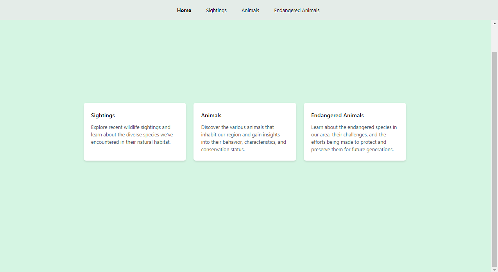
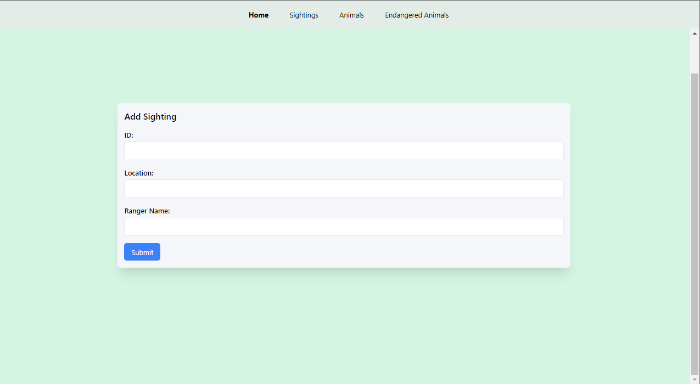
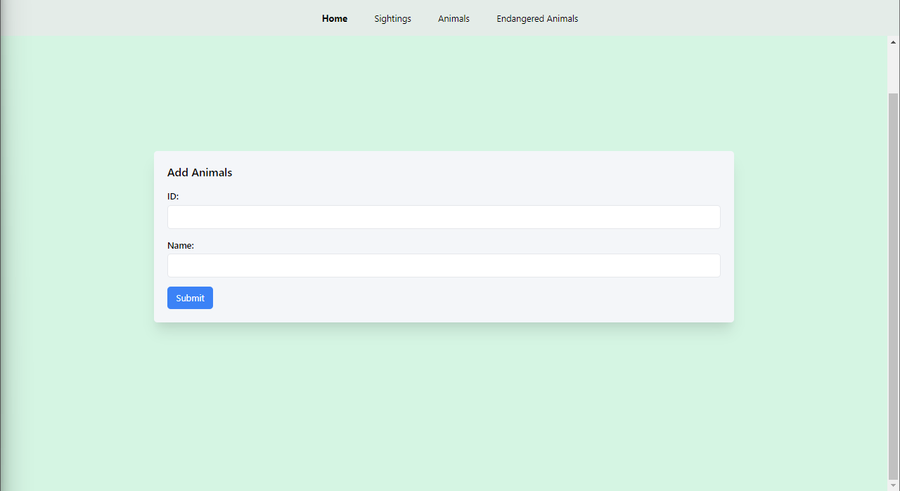
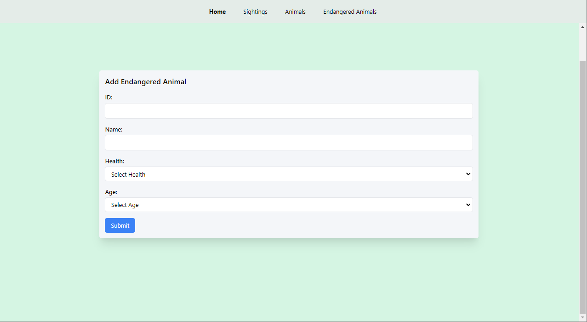

# Wildlife Tracker App 🦁🌿

Welcome to the Wildlife Tracker App! 

The app is built using React and styled with Tailwind CSS.

The app uses the following fonts:

- **Heading Font**: Montserrat
- **Body Font**: Raleway
 


## Getting Started

To run the project locally, follow these steps:

1. Clone the repository:
```sh
git clone https://github.com/cosmasnyairo/wildlife-tracker.git
```
2. Install project dependencies:
```sh
npm install
```
3. Build the CSS styles 
```sh
npm run build:css
```
4. Start the application:
```
npm start
```

## Screenshots

Here are some screenshots of the different sections of the app:

### Home Page


### Sightings Form


### Animals Form


### Endangered Animals Form



## Feedback and Contributions

Happy tracking and preserving our wonderful wildlife! 🌍🐾
